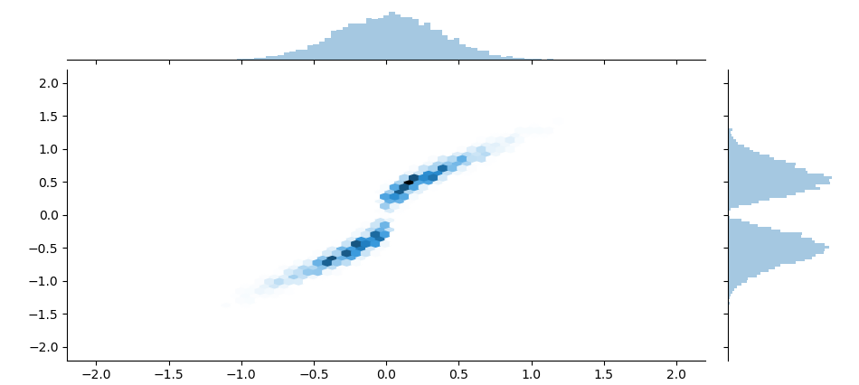

# OptimalTransport.jl
---
Optimal transport algorithms for Julia.

[](https://travis-ci.com/zsteve/OptimalTransport.jl.svg?branch=master)



This package provides some implementations of optimal transport algorithms, including the Sinkhorn scaling algorithm and variants. 

## Supported algorithms

Currently, Earth Mover's Distance (solution to exact problem) is wrapped via PyCall using the excellent [POT (Python Optimal Transport)](https://pythonot.github.io/) library. The hope is that _gradually_, more and more functionality will be implemented in native Julia.

However, the following algorithms are offered natively:

* Sinkhorn algorithm (`sinkhorn`, `sinkhorn2`)
* Log-stabilized Sinkhorn algorithm (`sinkhorn_stabilized`)
* Epsilon-scaling stabilized Sinkhorn algorithm (`sinkhorn_stabilized_epsscaling`) 
* Unbalanced Sinkhorn algorithm (`sinkhorn_unbalanced`)

See the documentation pages for further documentation. Most calling conventions are analogous to those in the Python Optimal Transport library.

## Documentation

Read the [documentation](http://zsteve.phatcode.net/OptimalTransportDocs/)

## Basic usage and examples

Example: Sinkhorn algorithm via `sinkhorn`
```julia
N = 200; M = 200
μ_spt = rand(N)
ν_spt = rand(M)

μ = fill(1/N, N)
ν = fill(1/M, M) 
C = pairwise(SqEuclidean(), μ_spt', ν_spt')
ϵ = 0.01

γ = sinkhorn(μ, ν, C, ϵ)
```

See `examples/examples.jl` for a small collection of optimal transport examples using OptimalTransport.jl.

## References

Peyré, G. and Cuturi, M., 2019. Computational optimal transport. Foundations and Trends® in Machine Learning, 11(5-6), pp.355-607.

